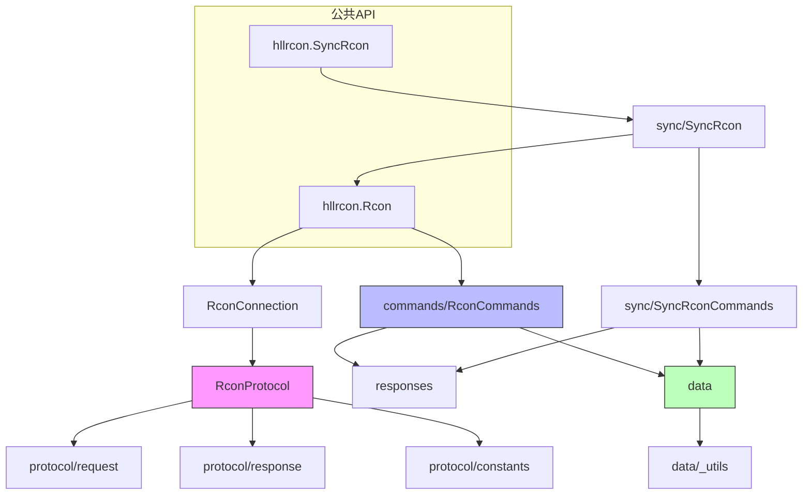

# hllrcon 架构说明文档

> 最后更新日期：2026-05-28

---

## 1. 项目概述

### 1.1 项目背景

`hllrcon` 是 [Hell Let Loose](https://www.hellletloose.com/game/hll) 游戏 RCONv2 协议的异步 Python 实现。它允许开发者以编程方式与 HLL 游戏服务器交互，执行管理员命令（踢人、封禁、换图、广播等）、查询玩家与服务器状态，并提供丰富的游戏内元数据（地图、阵营、武器、载具等）。

### 1.2 技术栈选型依据

| 技术 | 选型依据 |
|------|---------|
| **Python 3.11+** | 充分利用原生 `asyncio`、`typing` 改进与性能优化；库的现代基线。 |
| **Pydantic v2** | 强类型响应模型与数据校验；RCON 返回的 JSON 可直接反序列化为结构化对象。 |
| **typing-extensions** | 兼容高版本类型特性（如 `@override`），确保类型系统表达力。 |
| **asyncio.Protocol** | 底层直接基于 `asyncio.Transport` 实现 TCP 协议，避免引入外部网络库，保持轻量。 |
| **uv / hatchling** | 现代 Python 打包与依赖管理；`pyproject.toml` 为单一配置源。 |
| **pytest + pytest-asyncio** | 单元测试与异步测试标准方案；覆盖率要求 100%。 |
| **ruff + mypy** | 统一 lint、format 与静态类型检查，保证代码风格一致。 |

---

## 2. 代码组织与目录结构

```text
hllrcon/
├── __init__.py          # 包入口：聚合对外暴露的公共 API
├── client.py            # RconClient 抽象基类，定义连接生命周期契约
├── connection.py        # RconConnection：单连接封装，直接暴露命令调用
├── rcon.py              # Rcon：自动重连客户端，对多协程并发安全
├── commands.py          # RconCommands：所有 RCON 命令的高层封装
├── responses.py         # Pydantic 响应模型（玩家信息、服务器配置、封禁列表等）
├── exceptions.py        # 异常层次体系（连接/协议/命令/消息错误）
├── py.typed             # PEP 561 标记，表示包携带类型信息
├── data/                # 游戏静态数据（地图、阵营、武器、载具、据点等）
│   ├── __init__.py
│   ├── _utils.py        # IndexedBaseModel / CaseInsensitiveIndexedBaseModel 基类
│   ├── factions.py
│   ├── game_modes.py
│   ├── layers.py        # Layer 定义，含据点、坐标、环境信息
│   ├── loadouts.py
│   ├── maps.py
│   ├── roles.py
│   ├── sectors.py       # Sector / Strongpoint / Grid / CaptureZone
│   ├── teams.py
│   ├── vehicles.py
│   └── weapons.py
├── protocol/            # RCONv2 协议实现
│   ├── __init__.py
│   ├── constants.py     # 协议魔数、头部长度、最大负载、超时默认值
│   ├── protocol.py      # RconProtocol：asyncio.Protocol 子类，核心收发逻辑
│   ├── request.py       # RconRequest：请求打包（JSON + struct header）
│   └── response.py      # RconResponse / RconResponseStatus：响应解析
└── sync/                # 同步兼容层
    ├── __init__.py
    ├── commands.py      # 由脚本自动生成，SyncRconCommands（同步版命令封装）
    └── rcon.py          # SyncRcon：在后台线程运行事件循环的同步客户端

scripts/                 # 开发工具脚本
├── export_data.py
├── extract_loadouts.py
├── extract_strongpoints.py
├── generate_command_schema.py
└── generate_sync_commands.py  # 依据 hllrcon/commands.py 自动生成 sync/commands.py

tests/                   # 测试套件
├── test_*.py            # 单元测试（协议、连接、命令、数据模型等）
└── integration_tests/   # 集成测试（需真实 HLL 服务器环境变量）
```

---

## 3. 模块架构与核心职责

### 3.1 protocol 层 — 二进制协议引擎

`protocol` 是库的最低层，直接负责 TCP 上的 RCONv2 字节流通信。

- **数据包格式**：每包 12 字节头部（`magic[4] + request_id[4] + payload_len[4]`，小端）+ JSON 载荷。
- **加密**：握手后服务器下发 XOR key，后续载荷通过 XOR 加解密。
- **状态机**：`ProtocolState` 枚举管理连接生命周期（DISCONNECTED → CONNECTING → CONNECTED → AUTHENTICATING → AUTHENTICATED → CLOSING → CLOSED）。
- **请求关联**：`RconRequest` 使用进程级自增 ID（线程锁保护）将请求与响应对齐；等待者以 `asyncio.Future` 存储于 `_waiters` 字典。
- **防御机制**：
  - 粘包处理：`bytearray` 缓冲区循环读取，支持头部错位恢复。
  - 反 DoS：`MAX_PAYLOAD_SIZE = 16 MiB`，超限直接丢弃头部。
  - TCP keepalive + 可选应用层 heartbeat。

> 你通常**不应**直接使用 `RconProtocol`，而是使用上层的 `RconConnection` 或 `Rcon`。

### 3.2 connection 层 — 单连接管理

`RconConnection` 是一次性连接封装：

- 持有 `RconProtocol` 实例，转发 `execute()` 调用。
- 在连接丢失时抛出 `HLLConnectionLostError`。
- 断开即废弃，不可复用。
- 暴露 `on_disconnect` 回调供上层（如 `Rcon`）监听。

### 3.3 rcon 层 — 自动重连与并发安全

`Rcon` 是面向生产环境的主力客户端：

- **自动重连**：`reconnect_after_failures` 控制连续失败多少次后主动拆链重建（`0` 则禁用）。
- **并发安全**：`asyncio.Lock` + `asyncio.Future` 实现“单协程建连、多协程等待共享结果”。
- **失败计数器**：`TimeoutError` / `OSError` / `HLLConnectionError` 会累加 `_failure_count`，成功则清零。
- **上下文管理器**：`async with rcon.connect(): ...` 保证连接退出时断开。

### 3.4 commands 层 — 命令 DSL

`RconCommands` 定义了所有 RCON 命令的 Python 方法（约 50+ 个）。关键设计：

- **抽象 `execute` 方法**：子类/混入层只需实现 `execute(command, version, body)`，无需关心网络。
- **装饰器转换**：
  - `@cast_response_to_model(Model)`：将 JSON 字符串自动反序列化为 Pydantic 模型。
  - `@cast_response_to_model(Model, lambda r: r.field)`：提取嵌套字段。
  - `@cast_response_to_bool({400})`：将特定状态码的命令异常转化为 `False`。
- **命令参数**：大多数命令使用 API version `2`，body 为 JSON 对象或空字符串。

### 3.5 responses 层 — 类型化响应模型

所有响应继承自 `Response(BaseModel)`，使用 `to_camel` 别名生成器兼容服务端驼峰字段。核心模型：

- `GetPlayerResponse` / `GetPlayersResponse`：玩家实时数据（坐标、击杀、阵营、兵种等）。
- `GetServerSessionResponse`：当前对局状态（比分、剩余时间、人数）。
- `GetMapRotationResponse`：地图轮换/队列。
- `GetBansResponse`：封禁列表。

### 3.6 data 层 — 游戏静态元数据

提供无需网络即可访问的游戏知识库：

- `Layer`：地图层（地图 + 游戏模式 + 时间/天气 + 据点布局）。约 150+ 个类缓存属性定义所有官方 layer。
- `Map`、`Faction`、`Weapon`、`Vehicle`、`Role`、`GameMode` 等：均为 `IndexedBaseModel` 子类，支持 `by_id()` 全局查找。
- **索引基类**：`IndexedBaseModel` 在 `model_post_init` 时自动注册实例到类级 `_lookup_map`，实现 O(1) 查找；`CaseInsensitiveIndexedBaseModel` 用于大小写不敏感 ID（如 Layer）。
- `sectors.py`：定义据点（Strongpoint）、占领区（CaptureZone）与坐标网格（Grid），支持 `is_inside()` 判定玩家位置。

### 3.7 sync 层 — 同步桥接

`SyncRcon` 为同步代码提供阻塞式 API：

- 内部启动一个 daemon 线程运行独立 `asyncio` 事件循环。
- 通过 `asyncio.run_coroutine_threadsafe` 将同步调用转译为异步执行。
- `SyncRconCommands` 由 `scripts/generate_sync_commands.py` **自动生成**，保持与异步命令层 API 一致。

---

## 4. 模块间依赖关系



**接口契约**：

| 接口 | 输入 | 输出 | 约束 |
|------|------|------|------|
| `RconProtocol.execute` | `command: str`, `version: int`, `content_body: dict/str` | `RconResponse` | 必须在已连接状态下调用；超时抛出 `TimeoutError`。 |
| `RconConnection.execute` | 同上 | `str` (body) | 包装 `protocol.execute` 并调用 `raise_for_status()`。 |
| `Rcon.execute` | 同上 | `str` (body) | 自动获取/重建连接；对 `TimeoutError`/`OSError` 计数。 |
| `RconCommands.execute` | 同上 | `str` (body) | 抽象方法；由 `RconConnection` 或 `Rcon` 实现。 |
| `SyncRcon.execute` | 同上 | `str` (body) | 同步阻塞；内部转交后台事件循环。 |

---

## 5. 关键数据流向

### 5.1 请求-响应完整生命周期

```
调用方
  │  await rcon.get_players()
  ▼
RconCommands.get_players            # 组装命令名 + version + body
  │  await self.execute("GetServerInformation", 2, {"Name":"players","Value":""})
  ▼
Rcon.execute / RconConnection.execute
  │  protocol.execute(...)
  ▼
RconProtocol.execute
  │  1. 构造 RconRequest → pack() → header + xor(body)
  │  2. transport.write(message)
  │  3. 注册 waiter Future
  │  4. await asyncio.wait_for(waiter, timeout)
  ▼
服务器返回 TCP 数据
  │
RconProtocol.data_received ──► _buffer.extend(data)
  │                            _read_from_buffer()
  │                              1. 校验 magic / 长度
  │                              2. xor 解密
  │                              3. RconResponse.unpack()
  │                              4. waiter.set_result(pkt)
  ▼
Future 完成，结果沿调用栈返回
  │
RconConnection.execute
  │  response.raise_for_status()   # 非 200 抛 HLLCommandError
  │  return response.content_body   # JSON 字符串
  ▼
@cast_response_to_model(GetPlayersResponse)
  │  model_validate_json(result)
  ▼
调用方得到 GetPlayersResponse 对象
```

### 5.2 自动重连时序

```
[调用方 A]          [调用方 B]           [Rcon._lock]           [后台]
    │                  │                     │
    │ await get_players()                   │
    │──────────────────────────────────────►│ 无连接，开始建连
    │                  │                    │ 创建 _connecting Future
    │                  │                    │
    │                  await get_map_rotation()
    │                  │───────────────────►│ 发现 _connecting 已存在
    │                  │                    │ await 同一 Future
    │                  │◄───────────────────│
    │                  │                    │
    │◄─────────────────────────────────────│ Future 完成，共享连接
    │                  │                    │
```

### 5.3 同步层桥接流程

```
主线程：SyncRcon.get_players()
  │
  ├─► 若后台线程未启动，创建 Thread + asyncio.new_event_loop()
  ├─► asyncio.run_coroutine_threadsafe(rcon.get_players(), loop)
  │
  ▼
后台线程事件循环执行异步 Rcon.get_players()
  │
  ▼
结果通过 concurrent.futures.Future 返回到主线程
  │
  ▼
主线程 .result() 阻塞等待并返回
```

---

## 6. 环境搭建与开发工作流

### 6.1 环境要求

- Python `>= 3.11`
- 推荐工具：`uv`（`pip install uv`）

### 6.2 安装依赖

```bash
# 同步项目依赖与开发依赖
uv sync

# 或传统方式
pip install -e ".[dev]"
```

### 6.3 代码检查

```bash
# Lint + Format
ruff check --fix .
ruff format .

# 类型检查
mypy hllrcon
```

### 6.4 测试

```bash
# 单元测试（覆盖率）
pytest --cov=hllrcon --cov-report=term-missing

# 集成测试（需真实 HLL 服务器）
export HLL_HOST=127.0.0.1
export HLL_PORT=12345
export HLL_PASSWORD=your_password
pytest tests/integration_tests/
```

### 6.5 生成同步命令层

若修改了 `hllrcon/commands.py`，必须同步生成同步层：

```bash
python scripts/generate_sync_commands.py
```

此脚本会覆盖 `hllrcon/sync/commands.py` 与 `tests/test_sync_commands.py`。

---

## 7. 调试场景与故障排查

### 7.1 日志配置

`Rcon`、`RconConnection`、`RconProtocol` 均接受可选 `logger: logging.Logger`：

```python
import logging
logging.basicConfig(level=logging.DEBUG)
rcon = Rcon(..., logger=logging.getLogger("hll"))
```

日志级别说明：
- `INFO`：连接建立/断开、认证成功。
- `DEBUG`：发包/收包 ID、命令名、心跳触发。
- `WARNING`：连接丢失、magic 错位、无 waiter 的孤儿包、心跳失败。
- `ERROR`：超大 payload、解包失败。

### 7.2 常见场景排查

| 现象 | 排查步骤 | 典型根因 |
|------|---------|---------|
| `HLLConnectionTimeoutError` | 检查防火墙与端口可达性；确认服务器已启动 RCON | 网络不通或端口未监听。 |
| `HLLAuthError` | 核对密码；检查服务器 `Game.ini` 中 RCON 配置 | 密码错误或服务器未启用 RCON。 |
| `HLLCommandError (400)` | 检查参数类型与范围；查阅 `commands_schema.json` | 请求参数非法（如玩家不在线）。 |
| `HLLCommandError (500)` | 重试一次；检查服务器是否正在换图或负载高 | 服务器内部瞬时错误。 |
| `TimeoutError` 频发 | 增大 `timeout`；开启 `heartbeat_interval`；检查网络抖动 | 请求超时，连接可能已半死。 |
| 同步客户端卡死 | 检查是否从多线程并发调用阻塞方法；改用 `execute_concurrently` | 后台线程被阻塞。 |
| `Layer.by_id()` 返回未知 layer | 确认游戏版本与库版本兼容；检查 layer ID 拼写 | 游戏更新引入新 layer，库未跟进。 |

### 7.3 协议层调试技巧

在测试或本地环境中，可直接构造 `RconProtocol` 并抓包：

```python
proto = await RconProtocol.connect(host, port, password)
response = await proto.execute("GetServerInformation", 2, {"Name": "serverconfig", "Value": ""})
print(response.status_code, response.content_dict)
proto.disconnect()
```

---

## 8. 代码修改、重构与功能扩展最佳实践

### 8.1 添加新的 RCON 命令

1. 在 `hllrcon/commands.py` 的 `RconCommands` 类中添加 `async def xxx(self, ...)`。
2. 使用 `@cast_response_to_model(Model)` 或 `@cast_response_to_bool({400})` 包装返回值。
3. 若命令有返回体，在 `hllrcon/responses.py` 中定义对应的 Pydantic 模型。
4. 运行 `python scripts/generate_sync_commands.py` 生成同步层代码。
5. 在 `tests/test_commands.py` 与 `tests/test_sync_commands.py` 中补充单元测试。
6. 确保 `mypy` 无类型错误，`pytest --cov` 覆盖新代码 100%。

### 8.2 修改数据模型

- `data/` 下模型继承自 `IndexedBaseModel` 或 `CaseInsensitiveIndexedBaseModel`；注册逻辑在 `model_post_init` 中自动完成，**不要手动维护列表**。
- 若新增 `Layer`，按现有命名规范（`MAPNAME_GAMEMODE_ENVIRONMENT`）添加 `@class_cached_property`，并确保 `sectors` 与 `grid` 参数正确。
- `Layer` 构造函数中通过 `model_validator` 完成反向引用（`sector._layer = self`）与坐标偏移，修改时注意不要破坏 frozen 模型约束。

### 8.3 协议层变更

- `protocol/constants.py` 中的魔数与格式字段必须与服务器实现严格一致；非兼容升级需同步更新 `__min_server_version__`。
- `RconRequest._next_id` 为进程级计数器，多线程/多协程共享；改动时需保证线程安全。

### 8.4 保持 API 兼容性

- `hllrcon/__init__.py` 中的 `__all__` 显式控制公共 API；新增导出需同步加入。
- 同步层 `hllrcon/sync/commands.py` 为**生成文件**，禁止手动编辑。
- 异常层次位于 `hllrcon/exceptions.py`，新增异常应继承 `HLLError` 或其子类。

### 8.5 版本号管理

- `pyproject.toml` 的 `version` 与 `hllrcon/__init__.py` 的 `__version__` 必须**同步修改**。
- 采用 `GRADE.MAJOR.MINOR.PATCH` 四级版本：
  - `GRADE`：结构级变动（如 Vietnam 扩展）。
  - `MAJOR`：不兼容 API 变更。
  - `MINOR`：放弃对旧游戏版本的支持。
  - `PATCH`：向后兼容的修复/小功能。

---

## 9. 附录：极简交互伪代码

### 9.1 自动重连客户端使用

```python
from hllrcon import Rcon, Layer

rcon = Rcon(host="1.2.3.4", port=12345, password="secret")

async with rcon.connect():
    await rcon.broadcast("Server restarting in 5 min")
    await rcon.change_map(Layer.FOY_WARFARE_DAY)
    players = await rcon.get_players()
    for p in players.players:
        print(p.name, p.faction, p.world_position)
```

### 9.2 自定义命令执行

```python
# 直接调用底层 execute，绕过高层封装
raw = await rcon.execute("CustomCommand", 2, {"Key": "Value"})
```

### 9.3 同步客户端使用

```python
from hllrcon.sync import SyncRcon

rcon = SyncRcon(host="1.2.3.4", port=12345, password="secret")
with rcon.connect():
    rcon.broadcast("Hello sync world")
```

### 9.4 响应模型扩展示例

```python
from pydantic import BaseModel
from hllrcon.responses import Response

class GetCustomResponse(Response):
    value: int

# 装饰器自动完成 JSON -> Model 转换
@cast_response_to_model(GetCustomResponse)
async def get_custom(self) -> str:
    return await self.execute("GetCustom", 2)
```

---

## 10. 维护与演进

- **同步层**：修改 `commands.py` 后务必运行 `generate_sync_commands.py`，否则 sync API 与 async API 将不一致。
- **测试**：任何行为变更必须伴随单元测试；集成测试仅在具备真实 HLL 服务器时运行。
- **Lint/Type**：提交前执行 `ruff check --fix .` 与 `mypy hllrcon`，确保零报错。
- **数据更新**：游戏版本迭代时，检查 `commands_schema.json`、layer 列表与武器/载具数据，按需增补。
