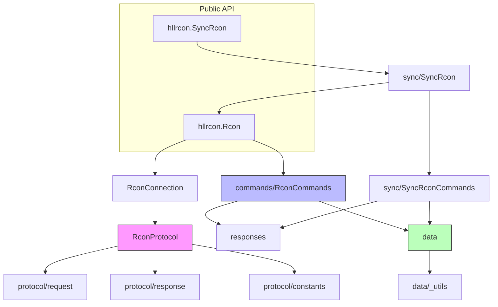

# hllrcon Architecture Documentation

> Last updated: 2026-05-28

---

## 1. Project Overview

### 1.1 Background

`hllrcon` is an asynchronous Python implementation of the [Hell Let Loose](https://www.hellletloose.com/game/hll) RCONv2 protocol. It allows developers to interact with HLL game servers programmatically, executing admin commands (kick, ban, change map, broadcast, etc.), querying player and server status, and providing rich in-game metadata (maps, factions, weapons, vehicles, etc.).

### 1.2 Technology Stack Rationale

| Technology | Rationale |
|-----------|-----------|
| **Python 3.11+** | Full use of native `asyncio`, `typing` improvements and performance optimizations; modern baseline for the library. |
| **Pydantic v2** | Strongly-typed response models and data validation; RCON-returned JSON can be directly deserialized into structured objects. |
| **typing-extensions** | Compatibility with high-version type features (e.g. `@override`), ensuring type system expressiveness. |
| **asyncio.Protocol** | Directly based on `asyncio.Transport` for TCP protocol implementation, avoiding external networking libraries, keeping it lightweight. |
| **uv / hatchling** | Modern Python packaging and dependency management; `pyproject.toml` as the single source of configuration. |
| **pytest + pytest-asyncio** | Standard solution for unit and async testing; 100% coverage requirement. |
| **ruff + mypy** | Unified lint, format and static type checking, ensuring consistent code style. |

---

## 2. Code Organization and Directory Structure

```text
hllrcon/
├── __init__.py          # Package entry: aggregates publicly exposed APIs
├── client.py            # RconClient abstract base class, defines connection lifecycle contract
├── connection.py        # RconConnection: single-connection wrapper, directly exposes command calls
├── rcon.py              # Rcon: auto-reconnecting client, safe for multi-coroutine concurrency
├── commands.py          # RconCommands: high-level wrappers for all RCON commands
├── responses.py         # Pydantic response models (player info, server config, ban lists, etc.)
├── exceptions.py        # Exception hierarchy (connection/protocol/command/message errors)
├── py.typed             # PEP 561 marker, indicating the package carries type information
├── data/                # Game static data (maps, factions, weapons, vehicles, strongpoints, etc.)
│   ├── __init__.py
│   ├── _utils.py        # IndexedBaseModel / CaseInsensitiveIndexedBaseModel base classes
│   ├── factions.py
│   ├── game_modes.py
│   ├── layers.py        # Layer definitions, including strongpoints, coordinates, environment info
│   ├── loadouts.py
│   ├── maps.py
│   ├── roles.py
│   ├── sectors.py       # Sector / Strongpoint / Grid / CaptureZone
│   ├── teams.py
│   ├── vehicles.py
│   └── weapons.py
├── protocol/            # RCONv2 protocol implementation
│   ├── __init__.py
│   ├── constants.py     # Protocol magic numbers, header size, max payload, default timeouts
│   ├── protocol.py      # RconProtocol: asyncio.Protocol subclass, core send/receive logic
│   ├── request.py       # RconRequest: request packing (JSON + struct header)
│   └── response.py      # RconResponse / RconResponseStatus: response parsing
└── sync/                # Synchronous compatibility layer
    ├── __init__.py
    ├── commands.py      # Auto-generated by script, SyncRconCommands (synchronous command wrappers)
    └── rcon.py          # SyncRcon: synchronous client running event loop in background thread

scripts/                 # Development utility scripts
├── export_data.py
├── extract_loadouts.py
├── extract_strongpoints.py
├── generate_command_schema.py
└── generate_sync_commands.py  # Auto-generates sync/commands.py based on hllrcon/commands.py

tests/                   # Test suite
├── test_*.py            # Unit tests (protocol, connection, commands, data models, etc.)
└── integration_tests/   # Integration tests (requires real HLL server environment variables)
```

---

## 3. Module Architecture and Core Responsibilities

### 3.1 Protocol Layer — Binary Protocol Engine

`protocol` is the lowest layer of the library, directly responsible for RCONv2 byte stream communication over TCP.

- **Packet format**: 12-byte header per packet (`magic[4] + request_id[4] + payload_len[4]`, little-endian) + JSON payload.
- **Encryption**: After handshake, the server sends an XOR key; subsequent payloads are encrypted/decrypted via XOR.
- **State machine**: `ProtocolState` enum manages connection lifecycle (DISCONNECTED → CONNECTING → CONNECTED → AUTHENTICATING → AUTHENTICATED → CLOSING → CLOSED).
- **Request correlation**: `RconRequest` uses a process-wide incrementing ID (thread-lock protected) to align requests with responses; waiters are stored in `_waiters` dict as `asyncio.Future`.
- **Defensive mechanisms**:
  - Sticky packet handling: `bytearray` buffer loops for reads, supports header misalignment recovery.
  - Anti-DoS: `MAX_PAYLOAD_SIZE = 16 MiB`, exceeding this directly drops the header.
  - TCP keepalive + optional application-layer heartbeat.

> You typically **should not** use `RconProtocol` directly; instead use the higher-level `RconConnection` or `Rcon`.

### 3.2 Connection Layer — Single Connection Management

`RconConnection` is a one-time connection wrapper:

- Holds a `RconProtocol` instance, forwards `execute()` calls.
- Throws `HLLConnectionLostError` when connection is lost.
- Discarded after disconnect, not reusable.
- Exposes `on_disconnect` callback for upper layers (e.g. `Rcon`) to listen.

### 3.3 Rcon Layer — Auto-reconnect and Concurrency Safety

`Rcon` is the main production client:

- **Auto-reconnect**: `reconnect_after_failures` controls how many consecutive failures before actively tearing down and rebuilding the connection (`0` disables).
- **Concurrency safety**: `asyncio.Lock` + `asyncio.Future` implements "single coroutine establishes connection, multiple coroutines wait for shared result".
- **Failure counter**: `TimeoutError` / `OSError` / `HLLConnectionError` increment `_failure_count`, success resets it.
- **Context manager**: `async with rcon.connect(): ...` guarantees disconnect on exit.

### 3.4 Commands Layer — Command DSL

`RconCommands` defines all RCON command Python methods (~50+). Key designs:

- **Abstract `execute` method**: Subclasses/mixins only need to implement `execute(command, version, body)`, no need to care about networking.
- **Decorator transformations**:
  - `@cast_response_to_model(Model)`: Automatically deserializes JSON string into Pydantic model.
  - `@cast_response_to_model(Model, lambda r: r.field)`: Extracts nested field.
  - `@cast_response_to_bool({400})`: Converts command exceptions with specific status codes to `False`.
- **Command parameters**: Most commands use API version `2`, body is JSON object or empty string.

### 3.5 Responses Layer — Typed Response Models

All responses inherit from `Response(BaseModel)`, using `to_camel` alias generator to be compatible with server-side camelCase fields. Core models:

- `GetPlayerResponse` / `GetPlayersResponse`: Player real-time data (coordinates, kills, faction, role, etc.).
- `GetServerSessionResponse`: Current match status (score, remaining time, player count).
- `GetMapRotationResponse`: Map rotation/queue.
- `GetBansResponse`: Ban list.

### 3.6 Data Layer — Game Static Metadata

Provides game knowledge base accessible without network:

- `Layer`: Map layers (map + game mode + time/weather + strongpoint layout). ~150+ class cached properties define all official layers.
- `Map`, `Faction`, `Weapon`, `Vehicle`, `Role`, `GameMode`, etc.: All are `IndexedBaseModel` subclasses, supporting `by_id()` global lookup.
- **Index base class**: `IndexedBaseModel` automatically registers instances to class-level `_lookup_map` in `model_post_init`, enabling O(1) lookup; `CaseInsensitiveIndexedBaseModel` for case-insensitive IDs (e.g. Layer).
- `sectors.py`: Defines strongpoints, capture zones (CaptureZone) and coordinate grids (Grid), supports `is_inside()` player position determination.

### 3.7 Sync Layer — Synchronous Bridge

`SyncRcon` provides blocking API for synchronous code:

- Internally starts a daemon thread running an independent `asyncio` event loop.
- Translates synchronous calls to async execution via `asyncio.run_coroutine_threadsafe`.
- `SyncRconCommands` is **auto-generated** by `scripts/generate_sync_commands.py`, maintaining API consistency with the async command layer.

---

## 4. Module Dependencies



**Interface contracts**:

| Interface | Input | Output | Constraints |
|-----------|-------|--------|-------------|
| `RconProtocol.execute` | `command: str`, `version: int`, `content_body: dict/str` | `RconResponse` | Must be called in connected state; throws `TimeoutError` on timeout. |
| `RconConnection.execute` | Same as above | `str` (body) | Wraps `protocol.execute` and calls `raise_for_status()`. |
| `Rcon.execute` | Same as above | `str` (body) | Auto acquires/rebuilds connection; counts `TimeoutError`/`OSError`. |
| `RconCommands.execute` | Same as above | `str` (body) | Abstract method; implemented by `RconConnection` or `Rcon`. |
| `SyncRcon.execute` | Same as above | `str` (body) | Synchronous blocking; internally delegates to background event loop. |

---

## 5. Key Data Flows

### 5.1 Request-Response Full Lifecycle

```
Caller
  │  await rcon.get_players()
  ▼
RconCommands.get_players            # Assemble command name + version + body
  │  await self.execute("GetServerInformation", 2, {"Name":"players","Value":""})
  ▼
Rcon.execute / RconConnection.execute
  │  protocol.execute(...)
  ▼
RconProtocol.execute
  │  1. Construct RconRequest → pack() → header + xor(body)
  │  2. transport.write(message)
  │  3. Register waiter Future
  │  4. await asyncio.wait_for(waiter, timeout)
  ▼
Server returns TCP data
  │
RconProtocol.data_received ──► _buffer.extend(data)
  │                            _read_from_buffer()
  │                              1. Validate magic / length
  │                              2. XOR decrypt
  │                              3. RconResponse.unpack()
  │                              4. waiter.set_result(pkt)
  ▼
Future completes, result returns up the call stack
  │
RconConnection.execute
  │  response.raise_for_status()   # Non-200 throws HLLCommandError
  │  return response.content_body   # JSON string
  ▼
@cast_response_to_model(GetPlayersResponse)
  │  model_validate_json(result)
  ▼
Caller receives GetPlayersResponse object
```

### 5.2 Auto-reconnect Sequence

```
[Caller A]          [Caller B]           [Rcon._lock]           [Background]
    │                  │                     │
    │ await get_players()                   │
    │──────────────────────────────────────►│ No connection, start establishing
    │                  │                    │ Create _connecting Future
    │                  │                    │
    │                  await get_map_rotation()
    │                  │───────────────────►│ _connecting already exists
    │                  │                    │ await the same Future
    │                  │◄───────────────────│
    │                  │                    │
    │◄─────────────────────────────────────│ Future completes, shared connection
    │                  │                    │
```

### 5.3 Sync Layer Bridge Flow

```
Main thread: SyncRcon.get_players()
  │
  ├─► If background thread not started, create Thread + asyncio.new_event_loop()
  ├─► asyncio.run_coroutine_threadsafe(rcon.get_players(), loop)
  │
  ▼
Background thread event loop executes async Rcon.get_players()
  │
  ▼
Result returned to main thread via concurrent.futures.Future
  │
  ▼
Main thread .result() blocks and returns
```

---

## 6. Environment Setup and Development Workflow

### 6.1 Requirements

- Python `>= 3.11`
- Recommended tool: `uv` (`pip install uv`)

### 6.2 Install Dependencies

```bash
# Sync project and dev dependencies
uv sync

# Or traditional way
pip install -e ".[dev]"
```

### 6.3 Code Checks

```bash
# Lint + Format
ruff check --fix .
ruff format .

# Type check
mypy hllrcon
```

### 6.4 Testing

```bash
# Unit tests (with coverage)
pytest --cov=hllrcon --cov-report=term-missing

# Integration tests (requires real HLL server)
export HLL_HOST=127.0.0.1
export HLL_PORT=12345
export HLL_PASSWORD=your_password
pytest tests/integration_tests/
```

### 6.5 Generate Synchronous Command Layer

If you modify `hllrcon/commands.py`, you must regenerate the sync layer:

```bash
python scripts/generate_sync_commands.py
```

This script overwrites `hllrcon/sync/commands.py` and `tests/test_sync_commands.py`.

---

## 7. Debugging Scenarios and Troubleshooting

### 7.1 Logging Configuration

`Rcon`, `RconConnection`, `RconProtocol` all accept optional `logger: logging.Logger`:

```python
import logging
logging.basicConfig(level=logging.DEBUG)
rcon = Rcon(..., logger=logging.getLogger("hll"))
```

Log level explanations:
- `INFO`: Connection established/disconnected, authentication successful.
- `DEBUG`: Packet send/receive IDs, command names, heartbeat triggers.
- `WARNING`: Connection lost, magic misalignment, orphan packets without waiter, heartbeat failure.
- `ERROR`: Oversized payload, unpack failure.

### 7.2 Common Scenario Troubleshooting

| Symptom | Troubleshooting Steps | Typical Root Cause |
|---------|----------------------|-------------------|
| `HLLConnectionTimeoutError` | Check firewall and port reachability; confirm server RCON is enabled | Network unreachable or port not listening. |
| `HLLAuthError` | Verify password; check server `Game.ini` RCON config | Wrong password or RCON not enabled on server. |
| `HLLCommandError (400)` | Check parameter types and ranges; consult `commands_schema.json` | Invalid request parameters (e.g. player not online). |
| `HLLCommandError (500)` | Retry once; check if server is changing map or under high load | Server internal transient error. |
| Frequent `TimeoutError` | Increase `timeout`; enable `heartbeat_interval`; check network jitter | Request timeout, connection may be half-dead. |
| Sync client deadlock | Check if blocking methods are called from multiple threads; use `execute_concurrently` | Background thread is blocked. |
| `Layer.by_id()` returns unknown layer | Confirm game version compatibility with library version; check layer ID spelling | Game update introduced new layer, library not updated. |

### 7.3 Protocol Layer Debugging Tips

In test or local environments, you can directly construct `RconProtocol` and capture packets:

```python
proto = await RconProtocol.connect(host, port, password)
response = await proto.execute("GetServerInformation", 2, {"Name": "serverconfig", "Value": ""})
print(response.status_code, response.content_dict)
proto.disconnect()
```

---

## 8. Best Practices for Code Changes, Refactoring and Feature Extensions

### 8.1 Adding New RCON Commands

1. Add `async def xxx(self, ...)` in `RconCommands` class in `hllrcon/commands.py`.
2. Wrap return value with `@cast_response_to_model(Model)` or `@cast_response_to_bool({400})`.
3. If command has response body, define corresponding Pydantic model in `hllrcon/responses.py`.
4. Run `python scripts/generate_sync_commands.py` to generate sync layer code.
5. Add unit tests in `tests/test_commands.py` and `tests/test_sync_commands.py`.
6. Ensure `mypy` has no type errors, `pytest --cov` covers new code 100%.

### 8.2 Modifying Data Models

- Models under `data/` inherit from `IndexedBaseModel` or `CaseInsensitiveIndexedBaseModel`; registration logic in `model_post_init` is automatic, **do not manually maintain lists**.
- When adding `Layer`, follow existing naming convention (`MAPNAME_GAMEMODE_ENVIRONMENT`) and add `@class_cached_property`, ensuring `sectors` and `grid` parameters are correct.
- `Layer` constructor uses `model_validator` for back-references (`sector._layer = self`) and coordinate offset; be careful not to break frozen model constraints when modifying.

### 8.3 Protocol Layer Changes

- Magic numbers and format fields in `protocol/constants.py` must strictly match server implementation; non-compatible upgrades need to update `__min_server_version__`.
- `RconRequest._next_id` is a process-level counter shared across threads/coroutines; changes must ensure thread safety.

### 8.4 Maintaining API Compatibility

- `__all__` in `hllrcon/__init__.py` explicitly controls public API; new exports must be added.
- Sync layer `hllrcon/sync/commands.py` is a **generated file**, manual editing is prohibited.
- Exception hierarchy is in `hllrcon/exceptions.py`; new exceptions should inherit from `HLLError` or its subclasses.

### 8.5 Version Management

- `version` in `pyproject.toml` and `__version__` in `hllrcon/__init__.py` must be **modified together**.
- Uses `GRADE.MAJOR.MINOR.PATCH` four-level versioning:
  - `GRADE`: Structural changes (e.g. Vietnam expansion).
  - `MAJOR`: Incompatible API changes.
  - `MINOR`: Drops support for old game versions.
  - `PATCH`: Backwards-compatible fixes/small features.

---

## 9. Appendix: Minimal Interaction Pseudocode

### 9.1 Auto-reconnect Client Usage

```python
from hllrcon import Rcon, Layer

rcon = Rcon(host="1.2.3.4", port=12345, password="secret")

async with rcon.connect():
    await rcon.broadcast("Server restarting in 5 min")
    await rcon.change_map(Layer.FOY_WARFARE_DAY)
    players = await rcon.get_players()
    for p in players.players:
        print(p.name, p.faction, p.world_position)
```

### 9.2 Custom Command Execution

```python
# Directly call low-level execute, bypassing high-level wrappers
raw = await rcon.execute("CustomCommand", 2, {"Key": "Value"})
```

### 9.3 Synchronous Client Usage

```python
from hllrcon.sync import SyncRcon

rcon = SyncRcon(host="1.2.3.4", port=12345, password="secret")
with rcon.connect():
    rcon.broadcast("Hello sync world")
```

### 9.4 Response Model Extension Example

```python
from pydantic import BaseModel
from hllrcon.responses import Response

class GetCustomResponse(Response):
    value: int

# Decorator automatically handles JSON -> Model conversion
@cast_response_to_model(GetCustomResponse)
async def get_custom(self) -> str:
    return await self.execute("GetCustom", 2)
```

---

## 10. Maintenance and Evolution

- **Sync layer**: After modifying `commands.py`, always run `generate_sync_commands.py`, otherwise sync API will be inconsistent with async API.
- **Testing**: Any behavioral change must be accompanied by unit tests; integration tests only run when a real HLL server is available.
- **Lint/Type**: Before committing, run `ruff check --fix .` and `mypy hllrcon`, ensuring zero errors.
- **Data updates**: When game versions iterate, check `commands_schema.json`, layer lists and weapon/vehicle data, adding as needed.
