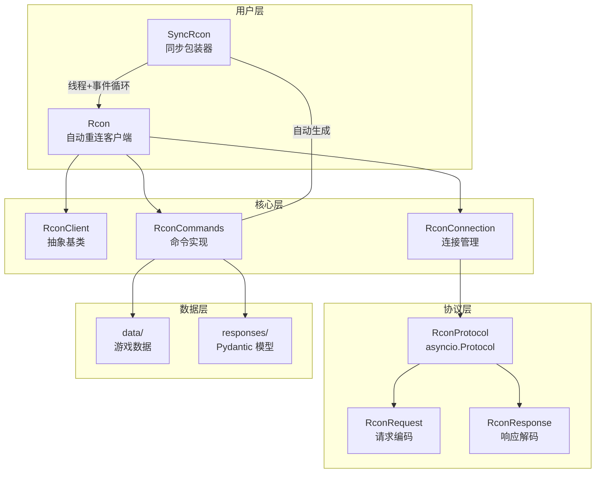

# hllrcon 架构审查报告

## 项目概览

```
hllrcon/
├── __init__.py          # 包入口，版本号 1.2.0.1
├── client.py            # RconClient (ABC)
├── commands.py          # 异步命令实现 (1457 lines)
├── connection.py        # RconConnection (RconCommands → RconProtocol)
├── exceptions.py        # 异常层级 (HLLError → ...)
├── rcon.py              # Rcon 自动重连客户端
├── responses.py         # Pydantic 响应模型 (448 lines)
├── protocol/
│   ├── constants.py     # 协议常量
│   ├── protocol.py      # RconProtocol (asyncio.Protocol, 630 lines)
│   ├── request.py       # RconRequest 编码
│   └── response.py      # RconResponse 解码
├── sync/
│   ├── commands.py      # 同步命令包装器 (自动生成, 1461 lines)
│   └── rcon.py          # SyncRcon (线程 + 事件循环)
└── data/                # HLL 游戏数据 (地图/阵营/武器/载具等)
```

## 严重级别 (Critical)

### C1. pyproject.toml URLs 指向上游仓库而非当前 Fork

- **文件**: [`pyproject.toml:32-33`](pyproject.toml:32-33)
- **当前值**:
  ```toml
  Repository = "https://github.com/timraay/hllrcon"
  Issues = "https://github.com/timraay/hllrcon/issues"
  ```
- **影响**: `pip show hllrcon`、PyPI 元数据、用户点击 "Repository" 都将跳转到原版仓库而不是本 fork
- **建议修复**: 改为 `https://github.com/simon7073/hllrcon`

---

## 高风险 (High)

### H1. SyncRcon._run_coroutine 的 `block` 参数是空操作（No-op）

- **文件**: [`hllrcon/sync/rcon.py:231-256`](hllrcon/sync/rcon.py:231-256)
- **代码**:
  ```python
  def _run_coroutine(self, coro: Any, *, block: bool = True) -> Future[str]:
      future = asyncio.run_coroutine_threadsafe(coro, self._loop)
      if block:        # ← 这两个分支完全一样
          return future
      return future
  ```
- **问题**: `block=True` 和 `block=False` 都返回同一个 `Future`。实际的阻塞发生在调用方显式调用 `.result()` 时。参数从未被用于控制行为。
- **影响**: 代码误导性——读者会认为 `block=False` 返回一个未完成的 Future 而 `block=True` 内部等待完成，但两者行为一致。
- **建议修复**: 移除 `block` 参数，或将其改为有实际行为的逻辑。

### H2. `execute()` 路径中存在冗余的 wait_until_connected 调用

- **文件**: [`hllrcon/sync/rcon.py:217-225`](hllrcon/sync/rcon.py:217-225) 和 [`hllrcon/sync/rcon.py:198-215`](hllrcon/sync/rcon.py:198-215)
- **调用链**:
  1. `SyncRcon.execute()` → `execute_concurrently().result()`
  2. `execute_concurrently()` → **`self.wait_until_connected()`** ← 第一次
  3. → `self._run_coroutine(self._rcon.execute(...))`
  4. `Rcon.execute()` → `await self._get_connection()` ← 内部又做了一次连接检查
- **影响**: 每次同步命令执行都做了双重连接检查，在高频调用场景有轻微性能损耗。
- **建议修复**: 在 `execute_concurrently` 中移除对 `wait_until_connected` 的调用，依赖 `Rcon.execute()` 内部管理连接生命周期。

---

## 中风险 (Medium)

### M1. protocol.py execute() 中 except 和 finally 块的 waiter 清理冗余

- **文件**: [`hllrcon/protocol/protocol.py:501-521`](hllrcon/protocol/protocol.py:501-521)
- **代码结构**:
  ```python
  try:
      self._waiters[request.request_id] = waiter
      ...
      response = await asyncio.wait_for(waiter, timeout=self.timeout)
  except Exception:
      self._waiters.pop(request.request_id, None)  # ← 冗余
      raise
  else:
      ...
      return response
  finally:
      self._waiters.pop(request.request_id, None)  # ← finally 也会执行
  ```
- **影响**: 异常路径下 `pop` 执行两次（except + finally），成功路径下也执行两次（else + finally）。虽然最终结果正确（第二次 pop 返回 None），但增加了读者理解负担。
- **建议修复**: 移除 `except` 块中的 `pop`，仅保留 `finally` 块即可。

### M2. sync/commands.py 与 commands.py 不同步风险

- **文件**: [`hllrcon/sync/commands.py:1-4`](hllrcon/sync/commands.py:1-4) — 标注为 `#  Generated using scripts/generate_sync_commands.py`
- **问题**: `sync/commands.py` 是自动生成的同步版本，但 CI 中没有步骤验证其与 `commands.py` 的一致性。如果直接修改 `commands.py` 而未重新生成，两者将不同步。
- **建议修复**: 在 CI `python.yaml` 中添加一步检查：运行 `generate_sync_commands.py` 然后 `git diff --exit-code`。

### M3. CI docs.yaml 的触发路径包含不再使用的文件

- **文件**: [`.github/workflows/docs.yaml:9-10`](.github/workflows/docs.yaml:9-10)
- **当前触发路径**: `README.md` 和 `plans/architecture.md`
- **问题**: 移除了 Sync docs 步骤后，这两个文件的变更不再影响文档构建，但仍会触发不必要的 CI 运行。
- **建议修复**: 从 `paths` 列表中移除 `README.md` 和 `plans/architecture.md`。

### M4. `__init__.py` 通配符导入禁用 ruff 检查

- **文件**: [`hllrcon/__init__.py:1`](hllrcon/__init__.py:1) — `# ruff: noqa: F403, F405`
- **问题**: `from .responses import *` 和 `from .exceptions import *` 禁用了 wildcard import 警告。如果 `responses.py` 中的 `__all__` 与 `__init__.py` 的 `__all__` 不一致，会在运行时暴露未预期的名称。

---

## 低风险 (Low)

### L1. `_read_from_buffer` 方法过长 (76 行)

- **文件**: [`hllrcon/protocol/protocol.py:347-423`](hllrcon/protocol/protocol.py:347-423)
- **问题**: 该方法处理了魔数扫描、长度验证、缓冲区切片、XOR 解密、解析和 waiter 通知等 6 个不同职责。
- **建议**: 可拆分为 `_scan_magic_header()`、`_validate_packet()`、`_dispatch_response()` 等小方法。

### L2. `protocol.py` 状态机状态 `CLOSING` 和 `CLOSED` 从未被赋值

- **文件**: [`hllrcon/protocol/protocol.py:56-65`](hllrcon/protocol/protocol.py:56-65)
- **问题**: `ProtocolState` 枚举定义了 `CLOSING` 和 `CLOSED` 状态，但在整个 `RconProtocol` 中从未使用。状态迁移路径为 `DISCONNECTED → CONNECTING → CONNECTED → AUTHENTICATING → AUTHENTICATED`，断开时直接回 `DISCONNECTED`。
- **建议**: 移除未使用的枚举值，或在实际断开逻辑中添加 `CLOSING` / `CLOSED` 状态设置。

---

## 信息性 (Info)

### I1. 架构亮点

- **分层清晰**: `ABC → 自动重连 → 连接包装 → 协议处理` 四层架构职责分明
- **线程模型优秀**: `SyncRcon` 通过 `run_coroutine_threadsafe` + 守护线程实现同步包装，避免了 GIL 问题
- **防御性编程**: 缓冲区解析有魔数扫描、长度上限、异常回退等多重保护
- **类型安全**: 广泛使用 `TYPE_CHECKING`、`ParamSpec`、`TypeVar`、Pydantic 模型
- **代码生成**: sync commands 自动生成减少手工同步错误

### I2. 架构图



### I3. 依赖分析

| 依赖 | 用途 | 替代方案 |
|------|------|---------|
| `pydantic>=2.11.5` | 响应模型验证、JSON 解析 | `dataclasses` + `json` |
| `typing-extensions>=4.13.2` | `override` 装饰器 | Python 3.12+ 内置 |
| `hatchling` | 构建后端 | `setuptools`, `poetry` |
| `asyncio` | 异步 I/O | 无替代（核心依赖） |

### I4. 测试覆盖观察

- 单元测试覆盖主要路径（协议编解码、命令执行、同步包装）
- 集成测试使用真实服务器（需要 `.env` 配置）
- 测试代码中无 `asyncio_mode = "auto"` 配置，依赖 `pytest-asyncio` 的 `asyncio_default_fixture_loop_scope`
